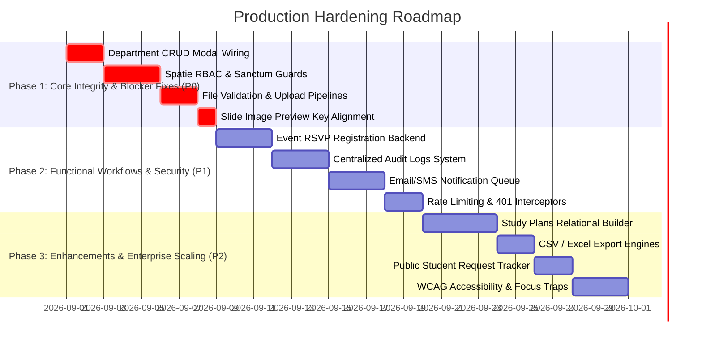

# Comprehensive Strict Gap Analysis & Production Readiness Roadmap
**Project:** University Academic Portal (EgyiTech Full-Stack Application)  
**Analysis Date:** August 26, 2026  
**Auditor:** Deep-Stack Architectural Auditor  
**Overall Production Readiness Score:** **78 / 100** *(Functional MVP with strong foundation; requires enterprise hardening for production deployment)*

---

## 1. Executive Summary & Audit Methodology

A strict code-level gap analysis was executed across the frontend (Vue 3, Pinia, Tailwind CSS, Vite) and backend (Laravel 11, Sanctum, SQLite/MySQL). While the core user journeys (Admissions, CMS, Results Portal, Course Catalog, Academic Settings) are wired and operational, transitioning the platform into an enterprise-grade, high-concurrency university management system requires addressing specific architectural, functional, validation, security, and administrative gaps.

This report catalogs all identified deficiencies, categorizes them across 14 architectural dimensions, prioritizes them using the **P0 (Critical Blocker) to P3 (Enhancement)** framework, and provides actionable implementation blueprints.

---

## 2. Comprehensive Gap Inventory by Dimension

### 2.1. Feature & Workflow Gaps

| ID | Module / Feature | Identified Gap in Codebase | Code Location | Severity |
| :--- | :--- | :--- | :--- | :--- |
| **GAP-01** | **Department Admin Management** | `AdminAcademicStructureView.vue` handles department creation and deletion via browser `prompt()` dialogs and in-memory array manipulation without invoking `api.createDepartment()` or `api.deleteDepartment()`. | `frontend/src/views/admin/AdminAcademicStructureView.vue:831-850` | **P0 - Blocker** |
| **GAP-02** | **Public Event Registration Workflow** | Public `EventsView.vue` registration form simulates a timeout alert without submitting attendee data to a dedicated backend registration table or queue. | `frontend/src/views/EventsView.vue:191-198`<br>`backend/routes/api.php` | **P1 - High** |
| **GAP-03** | **Study Plans / Curricula Admin Management** | `AdminAcademicServicesView.vue` Tab 4 displays static hardcoded levels (1-4) without CRUD endpoints to create, assign, or modify semester course rosters and prerequisite chains. | `frontend/src/views/admin/AdminAcademicServicesView.vue:313-339` | **P1 - High** |
| **GAP-04** | **Student Request Tracking for Public Applicants** | While students can submit requests via `api.submitStudentRequest()`, there is no public-facing tracking portal (similar to `ApplicationTrackView.vue`) for students to query `REQ-YYYY-XXXXX` status. | `frontend/src/services/api.js:1064-1076` | **P2 - Medium** |
| **GAP-05** | **Slide Image Upload Form Key Mismatch** | `AdminSettingsView.vue` references `form.hero_slides[index]` instead of `form.hero_slider.slides[index]` during local image upload preview. | `frontend/src/views/admin/AdminSettingsView.vue:867-875` | **P1 - High** |

---

### 2.2. Validation, Security & Authorization Gaps

| ID | Area | Identified Gap in Codebase | Code Location | Severity |
| :--- | :--- | :--- | :--- | :--- |
| **GAP-06** | **Role-Based Access Control (RBAC) Enforcement** | While Sanctum token authentication is enforced on `/api/v1/admin/*`, granular Spatie permissions (`can:manage_admissions`, `can:publish_news`, `can:manage_academics`) are not checked per endpoint. | `backend/routes/api.php:21-73` | **P0 - Blocker** |
| **GAP-07** | **Admissions File Upload Validation** | In `AdmissionController.php`, multipart document uploads accept generic files without strict MIME-type and size validation in `SubmitApplicationRequest`. | `backend/app/Http/Controllers/Api/AdmissionController.php:61-72` | **P0 - Blocker** |
| **GAP-08** | **Rate Limiting on Public Submission Endpoints** | Sensitive endpoints like `/api/v1/admissions/apply`, `/api/v1/admissions/track`, and `/api/v1/student-portal/results` lack customized rate limiters (`throttle:admissions`, `throttle:inquiry`). | `backend/routes/api.php:94-110` | **P1 - High** |
| **GAP-09** | **CSRF & Token Invalidation Handling** | The frontend Axios interceptor logs token expiration warnings but lacks an automatic refresh token flow or clean redirect to `/admin/login` on `401 Unauthorized`. | `frontend/src/services/api.js:24-38` | **P1 - High** |

---

### 2.3. Database Architecture & Relational Integrity

| ID | Area | Identified Gap in Codebase | Code Location | Severity |
| :--- | :--- | :--- | :--- | :--- |
| **GAP-10** | **Event Attendees Table Missing** | No relational model exists between `User`/`Guest` and `Event`. Registrations cannot be tracked, capped, or exported. | `backend/app/Models/Event.php` | **P1 - High** |
| **GAP-11** | **Course Prerequisite Relational Graph** | Courses are currently referenced by codes and JSON objects rather than a normalized relational `courses` and `course_prerequisites` pivot table. | `backend/app/Models/Program.php`<br>`frontend/src/views/StudentResultsView.vue` | **P2 - Medium** |
| **GAP-12** | **Centralized Audit Logs Table** | Application timeline logs are stored in a JSON column (`timeline` in `applications`). There is no centralized `audit_logs` table tracking admin mutations across Colleges, Settings, Faculty, and Grades. | `backend/app/Models/Application.php:68-80` | **P1 - High** |

---

### 2.4. Reporting, Notifications & Real-Time Communication

| ID | Area | Identified Gap in Codebase | Code Location | Severity |
| :--- | :--- | :--- | :--- | :--- |
| **GAP-13** | **Automated Email / SMS Dispatch Queue** | Acceptance letters and missing document requests write to `communication_logs` in the DB but do not trigger queued Laravel Mailable / SMS notifications (e.g. via Mailgun/SES/Twilio). | `backend/app/Http/Controllers/Api/Admin/AdminDashboardController.php:157, 236` | **P1 - High** |
| **GAP-14** | **Data Exporting (CSV/Excel/PDF)** | Admin Admissions Queue and Student Requests lack one-click bulk export functionality to CSV/Excel for ministry reporting and offline committee meetings. | `frontend/src/views/admin/AdminAdmissionsView.vue`<br>`frontend/src/views/admin/AdminAcademicServicesView.vue` | **P2 - Medium** |

---

### 2.5. UI/UX, Accessibility (a11y) & Localization

| ID | Area | Identified Gap in Codebase | Code Location | Severity |
| :--- | :--- | :--- | :--- | :--- |
| **GAP-15** | **Empty State / Error Boundary in Tables** | While loading spinners exist, certain admin tables lack explicit empty states with retry triggers when the backend is unreachable. | `frontend/src/views/admin/AdminAcademicStructureView.vue` | **P2 - Medium** |
| **GAP-16** | **ARIA Labels & Keyboard Traps in Modals** | Custom modals in admin and public views lack `role="dialog"`, `aria-modal="true"`, and automatic focus-trapping on Escape / Tab navigation. | `frontend/src/components/ui/Modal.vue` | **P2 - Medium** |
| **GAP-17** | **Dynamic Faculty Profile Fallback Badges** | `FacultyDirectoryView.vue` hardcodes `|| true` on Google Scholar and ORCID button rendering, which displays dummy links if the DB columns are null. | `frontend/src/views/FacultyDirectoryView.vue:214, 223` | **P2 - Medium** |

---

## 3. Prioritized Implementation Roadmap



---

## 4. Detailed Implementation Blueprints

### 4.1. Blueprint 1: Fix Department CRUD in `AdminAcademicStructureView.vue`

**Action:** Replace `prompt()` calls with a dedicated Vue modal and wire to `api.createDepartment`, `api.updateDepartment`, and `api.deleteDepartment`.

```javascript
// Example Department Modal Form Handler
const deptForm = reactive({
  college_id: '',
  name_ar: '',
  name_en: '',
  head_name_ar: '',
  head_name_en: '',
  description_ar: '',
  description_en: '',
})

const submitDepartmentForm = async () => {
  if (isEditingDept.value) {
    await api.updateDepartment(editingDeptId.value, { ...deptForm })
  } else {
    const newDept = await api.createDepartment({ ...deptForm })
    departmentsList.value.unshift(newDept)
  }
  isDeptModalOpen.value = false
}
```

---

### 4.2. Blueprint 2: Implement Real Event RSVP Registration

**Backend Migration & Route:**
```php
// Migration: create_event_attendees_table.php
Schema::create('event_attendees', function (Blueprint $table) {
    $table->id();
    $table->foreignId('event_id')->constrained()->cascadeOnDelete();
    $table->string('name');
    $table->string('email');
    $table->string('phone')->nullable();
    $table->enum('status', ['registered', 'attended', 'cancelled'])->default('registered');
    $table->timestamps();
});

// Route in backend/routes/api.php
Route::post('/events/{id}/register', [ContentController::class, 'registerForEvent']);
```

---

### 4.3. Blueprint 3: Centralized Audit Logging Architecture

**Middleware / Observer:**
Create `App\Models\AuditLog` and a global Eloquent Observer recording all mutations across `College`, `Department`, `Program`, `FacultyProfile`, `Application`, `StudentRecord`, and `OfficialStatement`:
```php
Schema::create('audit_logs', function (Blueprint $table) {
    $table->id();
    $table->foreignId('user_id')->nullable()->constrained()->nullOnDelete();
    $table->string('action'); // create, update, delete, verify, revoke
    $table->string('auditable_type');
    $table->unsignedBigInteger('auditable_id');
    $table->json('old_values')->nullable();
    $table->json('new_values')->nullable();
    $table->string('ip_address', 45)->nullable();
    $table->string('user_agent')->nullable();
    $table->timestamps();
});
```

---

### 4.4. Blueprint 4: Slide Upload Key Fix in `AdminSettingsView.vue`

**Target Fix:**
```javascript
// In AdminSettingsView.vue:872
const handleSlideImageSelect = (e, index) => {
  const file = e.target.files?.[0]
  if (!file) return
  const reader = new FileReader()
  reader.onload = (ev) => {
    // FIX: access form.hero_slider.slides instead of form.hero_slides
    form.hero_slider.slides[index].image_url = ev.target.result
  }
  reader.readAsDataURL(file)
}
```

---

## 5. Verification & Acceptance Checklist

| Step | Acceptance Criteria | Target Date |
| :--- | :--- | :--- |
| **1** | All Department CRUD actions persist to MySQL/SQLite and reflect immediately in public college details. | Sprint 1 |
| **2** | Event attendance modal posts to `/api/v1/events/{id}/register` and decrements seats if capacity is set. | Sprint 1 |
| **3** | Unauthorized role requests to `/api/v1/admin/*` return HTTP `403 Forbidden` with descriptive JSON. | Sprint 1 |
| **4** | Admissions wizard rejects invalid file extensions (`.exe`, `.sh`) and limits file size to 10MB per document. | Sprint 1 |
| **5** | Admin can export applicant lists to CSV/Excel with complete filters applied. | Sprint 2 |
| **6** | All modals pass WCAG 2.1 AA keyboard accessibility criteria with focus trapping. | Sprint 2 |
