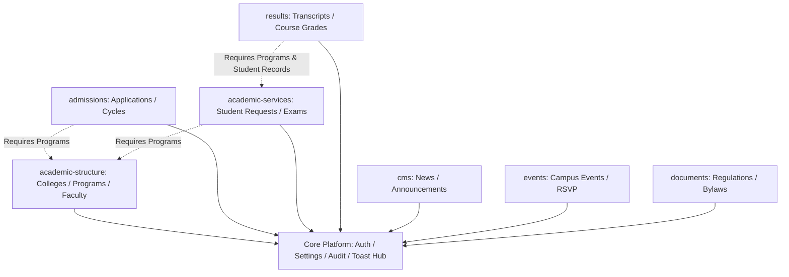

# Modular Plugin-Style Architecture Implementation Plan

> **For agentic workers:** REQUIRED SUB-SKILL: Use superpowers:subagent-driven-development (recommended) or superpowers:executing-plans to implement this plan task-by-task. Steps use checkbox (`- [ ]`) syntax for tracking.

**Goal:** Transform the monolithic Laravel + Vue architecture of the University Academic Portal into a production-grade, decoupled, plug-in style modular ecosystem where every domain (Admissions, Academic Structure, Academic Services, CMS, Events, Regulations & Documents, Results, Audit Trail, Settings) is an autonomous module that can be independently enabled/disabled, configured, versioned, migrated, routed, and tested without breaking the host application or neighboring modules.

**Architecture:** 
- **Backend (Laravel Module Engine)**: Modular monolith architecture leveraging a centralized `ModuleManager` service provider, dynamic module registries, explicit module dependency graph validation, domain-based database ownership (core vs module-owned tables), isolated routes (`/api/v1/modules/{module}`), dynamic event contracts, and policy-driven feature-flag evaluation.
- **Frontend (Vue 3 Micro-Module Engine)**: Centralized `ModuleRegistry` with asynchronous route lazy-loading, dependency-aware dynamic navigation sidebar injection, scoped Pinia stores, isolated module configuration views, feature-flag guards, and unified fallback boundaries.

**Tech Stack:**
- Backend: Laravel 11.x, PHP 8.2+, MySQL / SQLite (domain-based table ownership with foreign key integrity & soft data preservation), Laravel Event-Driven Contracts.
- Frontend: Vue 3 (Composition API, `<script setup>`), Pinia, Vue Router 4 (Dynamic `router.addRoute()`), Vite (Code Splitting / Dynamic Chunking), Tailwind CSS.

## Global Constraints

- **Database Ownership & Data Preservation**: 
  - Standardized relational integrity is preserved between core and domain tables.
  - Disabling a module suspended its queries, routes, and UI, but **NEVER** drops, alters, or corrupts underlying tables or historical data.
  - Core shared tables provide foundation identities (`users`, `site_settings`, `audit_logs`).
  - Domain tables belong strictly to their designated module with explicit foreign keys to shared core identities.
- **Explicit Module Dependency Graph**: 
  - Modules declare required dependencies (e.g. `admissions` depends on `academic-structure` for program selection; `academic-services` depends on `academic-structure`).
  - The `ModuleManager` validates dependency constraints before activation or deactivation.
  - Attempting to disable a module that is depended upon by an active sibling is blocked with a clear dependency violation warning and descriptive explanation.
- **Core Host Platform Primitives**:
  - Authentication & RBAC, Internationalization (i18n), Flash Toast Hub, Dialog Modal Provider, Theme & CSS Variables, Base Layouts, and Audit Logging Infrastructure.
- Full RTL/LTR and Arabic/English language integrity preserved across all module registration manifests.

---

## 1. Domain Decomposition, Database Ownership & Dependency Matrix

### Database Ownership Architecture:

| Table Name | Owner Module | Type | Relational Dependencies / FKs | Disabling Behavior |
| :--- | :--- | :--- | :--- | :--- |
| `users`, `site_settings`, `audit_logs` | **Core Platform** | Shared Core | None | Always active |
| `colleges`, `departments`, `programs`, `faculty_profiles` | **`academic-structure`** | Module-Owned | `users.id` (dean/faculty user link) | Tables preserved; public catalog & admin CRUD suspended |
| `admission_cycles`, `applications`, `application_documents` | **`admissions`** | Module-Owned | `programs.id`, `users.id` (reviewer) | Tables preserved; application portal & review queue suspended |
| `student_records`, `student_service_requests`, `exam_schedules`, `official_statements` | **`academic-services`** | Module-Owned | `programs.id`, `users.id` (handled_by) | Tables preserved; request forms & timetable endpoints suspended |
| `news_categories`, `news_articles`, `announcements` | **`cms`** | Module-Owned | `users.id` (author) | Tables preserved; news feeds & announcement banners hidden |
| `events`, `event_attendees` | **`events`** | Module-Owned | `users.id` (organizer) | Tables preserved; event calendar & registration suspended |
| `download_documents` | **`documents`** | Module-Owned | `users.id` (uploader) | Tables preserved; document repository & downloads suspended |
| `course_results`, `academic_terms` | **`results`** | Module-Owned | `programs.id`, `student_records.id` | Tables preserved; student grade lookup & transcript viewer suspended |

---

### Module Dependency Graph & Contracts:



#### Dependency Rules:
1. `academic-structure` is a foundational domain provider required by `admissions`, `academic-services`, and `results`.
2. Attempting to disable `academic-structure` while `admissions` is enabled will be blocked by `ModuleManager::canDisable('academic-structure')` returning:
   ```json
   {
     "can_disable": false,
     "blocking_dependents": ["admissions", "academic-services", "results"],
     "reason": "Cannot disable 'academic-structure' because it is required by active modules: Admissions, Academic Services, Results."
   }
   ```
3. Attempting to enable `admissions` while `academic-structure` is disabled will automatically prompt or require enabling `academic-structure` first.

---

## Implementation Tasks

### Task 1: Backend Modular Core Engine & Dependency Graph Validator
**Files:**
- Create: `backend/app/Core/Contracts/ModuleInterface.php`
- Create: `backend/app/Core/ModuleManager.php`
- Create: `backend/app/Core/DependencyValidator.php`
- Create: `backend/app/Core/Providers/ModuleServiceProvider.php`
- Create: `backend/config/modules.php`
- Test: `backend/tests/Feature/Core/ModuleManagerTest.php`

**Interfaces:**
- Consumes: Laravel Service Container, DB Facade.
- Produces: `ModuleManager::register()`, `ModuleManager::isEnabled($name)`, `ModuleManager::canDisable($name)`, `ModuleManager::validateDependencies($name)`.

- [ ] **Step 1: Write test for ModuleManager registry, dependency resolution, and blocking unsafe deactivations**
- [ ] **Step 2: Create `ModuleInterface` contract defining manifests, dependencies (`getDependencies()`), permissions, routes, and owned tables**
- [ ] **Step 3: Implement `DependencyValidator` with directed graph cycle detection and dependent checking**
- [ ] **Step 4: Implement `ModuleManager` with caching and dynamic module discovery**
- [ ] **Step 5: Register `ModuleServiceProvider` in Laravel config**
- [ ] **Step 6: Run tests and verify core module registry and dependency validation pass**

---

### Task 2: Backend Feature Flag & Module Lifecycle Policy with Dependency Guard
**Files:**
- Create: `backend/app/Core/Middleware/EnsureModuleEnabled.php`
- Create: `backend/app/Http/Controllers/Api/ModuleManagementController.php`
- Create: `backend/routes/core_api.php`
- Test: `backend/tests/Feature/Core/ModuleMiddlewareTest.php`

**Interfaces:**
- Consumes: `ModuleManager`, `DependencyValidator`
- Produces: Middleware `module.enabled:{module_slug}`, API endpoints `GET /api/v1/modules`, `PATCH /api/v1/modules/{module}/toggle`, `GET /api/v1/modules/{module}/dependencies`.

- [ ] **Step 1: Write tests for disabled module route blocking (404/503 response) and dependency conflict responses (409 Conflict)**
- [ ] **Step 2: Implement `EnsureModuleEnabled` route middleware**
- [ ] **Step 3: Create `ModuleManagementController` with dependency validation and safety checks**
- [ ] **Step 4: Mount module endpoints in API pipeline**
- [ ] **Step 5: Verify tests pass**

---

### Task 3: Backend Domain Modularization (Phase 1: Academic Structure & Admissions)
**Files:**
- Create: `backend/app/Modules/AcademicStructure/AcademicStructureModule.php`
- Create: `backend/app/Modules/AcademicStructure/Routes/api.php`
- Create: `backend/app/Modules/Admissions/AdmissionsModule.php`
- Create: `backend/app/Modules/Admissions/Routes/api.php`
- Modify: `backend/routes/api.php`
- Test: `backend/tests/Feature/Modules/AdmissionsModuleTest.php`

**Interfaces:**
- Consumes: `ModuleInterface`, `EnsureModuleEnabled`
- Produces: Domain-isolated route groups with explicit foreign key integrity and dependency metadata.

- [ ] **Step 1: Move Academic Structure controllers and models into `app/Modules/AcademicStructure` namespace, declaring ownership of `colleges`, `departments`, `programs`, `faculty_profiles`**
- [ ] **Step 2: Define `AcademicStructureModule` class implementing `ModuleInterface` with empty dependency array**
- [ ] **Step 3: Move Admissions controllers, models, and migrations into `app/Modules/Admissions` namespace, declaring ownership of `admission_cycles`, `applications`, `application_documents`**
- [ ] **Step 4: Define `AdmissionsModule` class implementing `ModuleInterface` declaring `['academic-structure']` dependency**
- [ ] **Step 5: Run PHPUnit tests to verify route isolation, relational integrity, and dependency enforcement**

---

### Task 4: Backend Domain Modularization (Phase 2: Academic Services, CMS, Events, Documents, Results)
**Files:**
- Create: `backend/app/Modules/AcademicServices/AcademicServicesModule.php`
- Create: `backend/app/Modules/Cms/CmsModule.php`
- Create: `backend/app/Modules/Events/EventsModule.php`
- Create: `backend/app/Modules/Documents/DocumentsModule.php`
- Create: `backend/app/Modules/Results/ResultsModule.php`
- Modify: `backend/routes/api.php`
- Test: `backend/tests/Feature/Modules/AllModulesTest.php`

**Interfaces:**
- Consumes: `ModuleManager`
- Produces: Cleanly separated domain packages with declared table ownership and dependencies.

- [ ] **Step 1: Modularize Academic Services into `app/Modules/AcademicServices` (depends on `['academic-structure']`)**
- [ ] **Step 2: Modularize CMS into `app/Modules/Cms` (zero domain dependencies)**
- [ ] **Step 3: Modularize Events into `app/Modules/Events` (zero domain dependencies)**
- [ ] **Step 4: Modularize Document Repository into `app/Modules/Documents` (zero domain dependencies)**
- [ ] **Step 5: Modularize Results into `app/Modules/Results` (depends on `['academic-structure', 'academic-services']`)**
- [ ] **Step 6: Run full backend test suite to ensure 100% regression-free operation and relational safety**

---

### Task 5: Frontend Micro-Module Registry & Dynamic Routing
**Files:**
- Create: `frontend/src/core/modules/moduleRegistry.js`
- Create: `frontend/src/core/modules/types.js`
- Create: `frontend/src/stores/modules.js`
- Modify: `frontend/src/router/index.js`
- Test: `frontend/tests/moduleRegistry.test.js`

**Interfaces:**
- Consumes: Vue Router, Pinia
- Produces: `moduleRegistry.register()`, `moduleRegistry.getEnabledRoutes()`, `moduleRegistry.getNavigationMenuItems()`, `moduleRegistry.validateDependencies()`.

- [ ] **Step 1: Write tests for client module registry, dependency validation, and dynamic route insertion**
- [ ] **Step 2: Build `moduleRegistry.js` with lifecycle hooks (`install`, `onEnable`, `onDisable`, `dependencies`)**
- [ ] **Step 3: Create `useModulesStore` in Pinia to sync enabled modules and dependency states with backend manifest**
- [ ] **Step 4: Update `router/index.js` to dynamically add active module routes via `router.addRoute()`**
- [ ] **Step 5: Verify routing fallback when a module route is accessed while disabled**

---

### Task 6: Frontend Module Packaging & Encapsulation
**Files:**
- Create: `frontend/src/modules/academic-structure/index.js`
- Create: `frontend/src/modules/admissions/index.js`
- Create: `frontend/src/modules/academic-services/index.js`
- Create: `frontend/src/modules/cms/index.js`
- Create: `frontend/src/modules/events/index.js`
- Create: `frontend/src/modules/documents/index.js`
- Create: `frontend/src/modules/results/index.js`
- Modify: `frontend/src/components/layout/AdminLayout.vue`
- Modify: `frontend/src/components/layout/Navbar.vue`

**Interfaces:**
- Consumes: `moduleRegistry`
- Produces: Decoupled plug-and-play frontend modules with explicit dependency descriptors.

- [ ] **Step 1: Package Academic Structure module with routes, nav items, and zero domain dependencies**
- [ ] **Step 2: Package Admissions module declaring dependency on `['academic-structure']`**
- [ ] **Step 3: Package Academic Services module declaring dependency on `['academic-structure']`**
- [ ] **Step 4: Package CMS, Events, Documents, and Results modules**
- [ ] **Step 5: Refactor `AdminLayout.vue` and `Navbar.vue` to compute nav menus dynamically from `moduleRegistry`**
- [ ] **Step 6: Run `npm run build` and verify bundle chunks are split per module**

---

### Task 7: Admin Module Center UI with Dependency Warning & Safety Modal
**Files:**
- Create: `frontend/src/views/admin/AdminModulesView.vue`
- Modify: `frontend/src/components/layout/AdminLayout.vue`
- Test: `frontend/tests/AdminModulesView.test.js`

**Interfaces:**
- Consumes: `useModulesStore`, `useDialog`, `useToast`
- Produces: Administrative management panel with dependency graph badges, unsafe deactivation blocker dialogs, and configuration panels.

- [ ] **Step 1: Build `AdminModulesView.vue` displaying module status, owned tables, and dependency badges**
- [ ] **Step 2: Implement dependency-aware toggle handlers that warn admins before deactivation when other active modules depend on the target**
- [ ] **Step 3: Verify dynamic sidebar updates and route protection upon toggling a module**
- [ ] **Step 4: Execute end-to-end build and smoke test all active modules**

---

## Phased Migration Strategy & Risk Mitigation

1. **Phase 1 (Core Module Engine & Dependency Validator)**: Deploy Backend `ModuleManager` and Frontend `ModuleRegistry` in non-breaking mode with dependency tree calculation.
2. **Phase 2 (Table Ownership Audit & Dual Routing)**: Validate foreign key constraints against shared core tables and domain tables without modifying table data or dropping schemas.
3. **Phase 3 (Encapsulation & Namespace Migration)**: Migrate domain models, controllers, and views into respective `/modules/*` namespaces.
4. **Phase 4 (Admin Live Control & Dependency Stress Testing)**: Activate Admin Module Center and verify dependency conflict prevention across all 8 modules.

## Acceptance Criteria
- [ ] Any module can be turned OFF from the Admin Module Center without data loss or corruption; tables and records remain intact.
- [ ] Attempting to disable a module depended upon by another active module (e.g. attempting to disable `academic-structure` while `admissions` is active) is rejected with a clear admin alert.
- [ ] When a module is safely disabled, its navigation items vanish and visiting its URLs triggers an authorized graceful fallback.
- [ ] All 8 domain modules (`admissions`, `academic-structure`, `academic-services`, `cms`, `events`, `documents`, `results`, `audit-trail`) operate with explicit dependency declarations and zero direct cross-imports.
- [ ] Frontend build passes cleanly with granular Vite code-split chunks for each module.
